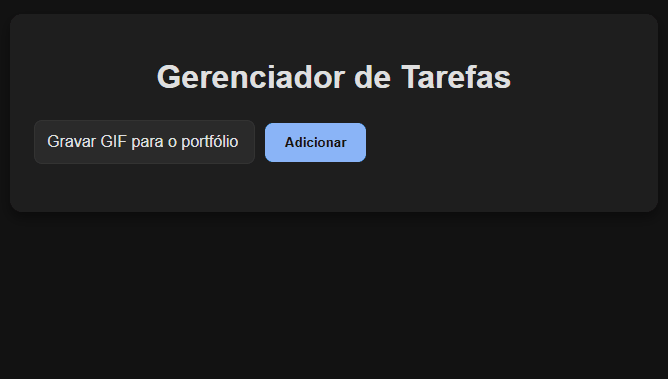

# Gerenciador de Tarefas Fullstack

<p align="left">
  
  
  
</p>



Este é um gerenciador de tarefas completo (CRUD) desenvolvido para fins de portfólio. A aplicação é construída com um backend robusto em Node.js e um frontend dinâmico em React.

## Funcionalidades

- **Criar Tarefa:** Adicione novas tarefas à lista.
- **Visualizar Tarefas:** Veja todas as tarefas salvas.
- **Editar Tarefa:** Altere o título de uma tarefa.
- **Marcar como Concluída:** Alterne o status de conclusão de uma tarefa.
- **Excluir Tarefa:** Remova tarefas da lista.

## Tecnologias Utilizadas

### Backend

- **Node.js**: Ambiente de execução JavaScript.
- **Express**: Framework web para o backend.
- **PostgreSQL**: Sistema de gerenciamento de banco de dados.
- **Axios**: Cliente HTTP para comunicação com a API.
- **dotenv**: Para gerenciar variáveis de ambiente.
- **cors**: Middleware para habilitar requisições de diferentes origens.

### Frontend

- **React**: Biblioteca JavaScript para a interface de usuário.
- **Vite**: Ferramenta de build para o ambiente de desenvolvimento.
- **CSS**: Para estilização personalizada.

## Como Rodar o Projeto

Siga os passos abaixo para iniciar o backend e o frontend da aplicação.

### 1. Backend

1.  Navegue até a pasta `backend` no seu terminal.
    ```bash
    cd backend
    ```
2.  Instale as dependências.
    ```bash
    npm install
    ```
3.  Crie um arquivo `.env` com suas credenciais do PostgreSQL.
    ```bash
    # Exemplo de conteúdo do arquivo .env
    DB_USER=seu_usuario
    DB_HOST=localhost
    DB_NAME=seu_banco
    DB_PASS=sua_senha
    DB_PORT=5432
    ```
4.  Inicie o servidor do backend.
    ```bash
    npm run dev
    ```

### 2. Frontend

1.  Abra um novo terminal e navegue até a pasta `frontend`.
    ```bash
    cd frontend
    ```
2.  Instale as dependências.
    ```bash
    npm install
    ```
3.  Inicie o servidor do frontend.
    ```bash
    npm run dev
    ```

A aplicação estará acessível em `http://localhost:5173/` (ou na porta que o Vite indicar).
